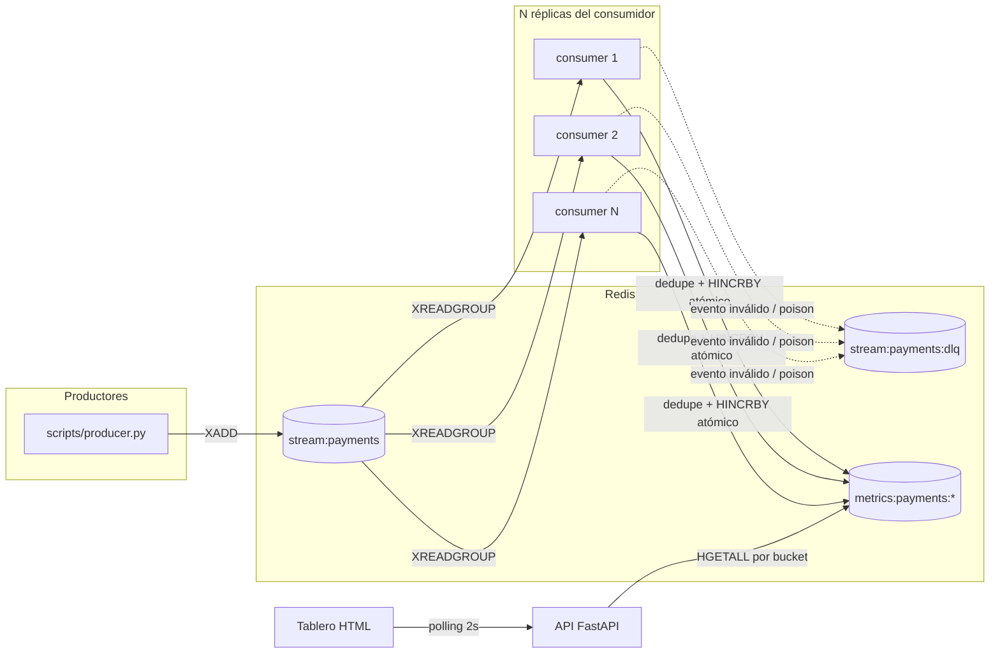

# Tablero de métricas de pagos

Servicio que consume eventos `payment.processed` / `payment.failed` desde una cola (Redis Streams) con varios consumidores en paralelo, y alimenta un tablero que muestra el conteo de pagos exitosos y fallidos **por minuto**, sin duplicar ni perder eventos ante reentregas o caídas de consumidor.

El razonamiento completo (por qué Redis Streams, cómo se evita el doble conteo, qué nivel de consistencia usa el tablero y qué cambiaría con 100x más volumen) está documentado como especificación versionada en `openspec/changes/payment-metrics-dashboard/` y como ADRs cortos en `docs/decisiones/`.

## Arquitectura



Cada consumidor deduplica por `event_id` y agrega al bucket de su minuto en una sola operación atómica (script Lua), antes de confirmar (`XACK`) la entrada — ver ADR 002 y 003.

## Cómo correrlo localmente

Requisitos: Docker y Docker Compose.

```bash
docker compose up --build --scale consumer=3
```

Esto levanta Redis (con AOF), la API en `http://localhost:8000` y 3 réplicas del consumidor. La API expone:

- `GET /metrics/payments?minutes=N` — JSON con el conteo `processed`/`failed` de los últimos N minutos (UTC).
- `GET /` — tablero HTML mínimo que hace polling cada 2 segundos sobre el endpoint anterior.

Para publicar eventos de prueba (requiere Python 3.10+ y las dependencias del proyecto instaladas, ver abajo):

```bash
python scripts/producer.py --count 200
```

## Desarrollo local (sin reconstruir la imagen)

```bash
python -m venv .venv
source .venv/Scripts/activate   # Windows: .venv\Scripts\activate
pip install -e ".[dev]"

docker compose up -d redis      # solo Redis, para desarrollo iterativo

make run-api                    # API con recarga automática
make run-consumer               # un consumidor (repetir en otra terminal para más réplicas)
```

## Tests

```bash
docker compose up -d redis
make test          # unit + integration
make test-unit      # solo unitarios (fakeredis, sin red)
make test-integration  # requieren Redis real en localhost:6379 (usa la base lógica 15)
```

Cobertura relevante: idempotencia ante duplicados, concurrencia con varios consumidores sin pérdida ni doble conteo, recuperación de pendientes tras una caída simulada, eventos tardíos/fuera de orden, eventos malformados y mensajes "poison", y reconexión con backoff ante Redis caído.

## Demo de duplicados y concurrencia

```bash
bash scripts/demo.sh
```

Levanta el stack completo con 3 consumidores, publica un lote de 200 eventos con duplicados intencionales (15%), eventos malformados (5%) y orden mezclado, y compara el conteo esperado (impreso por el productor) contra el que expone la API. En una corrida de referencia: 236 entradas publicadas (200 base + 36 duplicados), 185 eventos válidos únicos contados en el tablero, 18 entradas en dead-letter — sin duplicados ni pérdidas.

## Documentación

- `openspec/changes/payment-metrics-dashboard/proposal.md` — problema, alcance, no-alcance y supuestos.
- `openspec/changes/payment-metrics-dashboard/design.md` — decisiones técnicas, esquema de claves en Redis, riesgos.
- `openspec/changes/payment-metrics-dashboard/specs/` — contrato de comportamiento (casos borde como escenarios testeables).
- `docs/decisiones/` — ADRs cortos: tecnología de cola, deduplicación, consistencia, escalamiento a 100x, esquema de claves.
