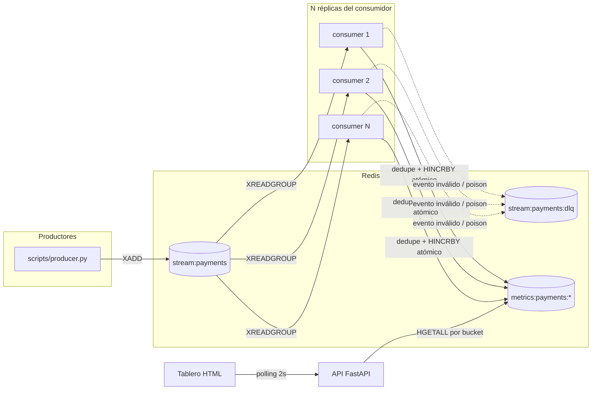

# Tablero de métricas de pagos

Servicio que consume eventos `payment.processed` / `payment.failed` desde una cola (Redis Streams) con varios consumidores en paralelo, y alimenta un tablero que muestra el conteo de pagos exitosos y fallidos **por minuto**, sin duplicar ni perder eventos ante reentregas o caídas de consumidor.

El razonamiento completo (por qué Redis Streams, cómo se evita el doble conteo, qué nivel de consistencia usa el tablero y qué cambiaría con 100x más volumen) está documentado como especificación versionada en `openspec/changes/payment-metrics-dashboard/` y como ADRs cortos en `docs/decisiones/`.

## Arquitectura



Cada consumidor deduplica por `event_id` y agrega al bucket de su minuto en una sola operación atómica (script Lua), antes de confirmar (`XACK`) la entrada — ver ADR 002 y 003.

## Cómo correrlo localmente

Requisitos: Docker y Docker Compose.

```bash
docker compose up --build --scale consumer=3
```

Esto levanta Redis (con AOF), la API en `http://localhost:8000` y 3 réplicas del consumidor. La API expone:

- `GET /metrics/payments?minutes=N` — JSON con el conteo `processed`/`failed` de los últimos N minutos (UTC).
- `GET /` — tablero HTML mínimo que hace polling cada 2 segundos sobre el endpoint anterior.

Para publicar eventos de prueba (requiere Python 3.10+ y las dependencias del proyecto instaladas, ver abajo):

```bash
python scripts/producer.py --count 200
```

## Desarrollo local (sin reconstruir la imagen)

```bash
python -m venv .venv
source .venv/Scripts/activate   # Windows: .venv\Scripts\activate
pip install -e ".[dev]"

docker compose up -d redis      # solo Redis, para desarrollo iterativo

make run-api                    # API con recarga automática
make run-consumer               # un consumidor (repetir en otra terminal para más réplicas)
```

## Tests

```bash
docker compose up -d redis
make test          # unit + integration
make test-unit      # solo unitarios (fakeredis, sin red)
make test-integration  # requieren Redis real en localhost:6379 (usa la base lógica 15)
```

Cobertura relevante: idempotencia ante duplicados, concurrencia con varios consumidores sin pérdida ni doble conteo, recuperación de pendientes tras una caída simulada, eventos tardíos/fuera de orden, eventos malformados y mensajes "poison", y reconexión con backoff ante Redis caído.

## Demo de duplicados y concurrencia

```bash
bash scripts/demo.sh
```

Levanta el stack completo con 3 consumidores, publica un lote de 200 eventos con duplicados intencionales (15%), eventos malformados (5%) y orden mezclado, y compara el conteo esperado (impreso por el productor) contra el que expone la API. En una corrida de referencia: 236 entradas publicadas (200 base + 36 duplicados), 185 eventos válidos únicos contados en el tablero, 18 entradas en dead-letter — sin duplicados ni pérdidas.

## Documentación

- `openspec/changes/payment-metrics-dashboard/proposal.md` — problema, alcance, no-alcance y supuestos.
- `openspec/changes/payment-metrics-dashboard/design.md` — decisiones técnicas, esquema de claves en Redis, riesgos.
- `openspec/changes/payment-metrics-dashboard/specs/` — contrato de comportamiento (casos borde como escenarios testeables).
- `docs/decisiones/` — ADRs cortos: tecnología de cola, deduplicación, consistencia, escalamiento a 100x, esquema de claves.

## Decisiones y trade-offs

El problema clásico de este servicio es **concurrencia vs. consistencia**: varios consumidores procesando la misma cola en paralelo no deben duplicar ni perder eventos. El detalle completo de cada decisión (opciones consideradas, por qué se descartaron las demás) está en `docs/decisiones/`; aquí el resumen ejecutable en una entrevista:

| # | Decisión | Elegido | Alternativas descartadas (y por qué) |
|---|---|---|---|
| [001](docs/decisiones/001-tecnologia-cola-eventos.md) | Tecnología de cola | Redis Streams: consumer groups nativos, recuperación de pendientes, y puede servir también de store de dedupe/agregación | RabbitMQ (no retiene mensajes, exige un store aparte) · Kafka (sobredimensionado para este volumen) · SQS+LocalStack (capa de emulación extra sin beneficio real) · cola en memoria (no compartible entre procesos, descartada sin ambigüedad) |
| [002](docs/decisiones/002-estrategia-deduplicacion.md) | Evitar doble conteo por reentrega | Script Lua atómico (`SET NX` + `HINCRBY` en una sola operación); ack **después** de aplicar, así una redelivery tras un crash entre aplicar y confirmar simplemente vuelve a ejecutar el script y no reincrementa | Constraint único en base de datos (agrega Postgres solo para esto) · contadores exactly-once transaccionales (complejidad desproporcionada, solo tiene sentido con Kafka) |
| [003](docs/decisiones/003-modelo-consistencia-tablero.md) | Nivel de consistencia | Eventual: cada bucket-minuto es atómico en sí mismo, pero no hay coordinación global entre buckets ni consumidores — es una métrica agregada de lectura, no un ledger | Consistencia fuerte con locks/transacciones globales (serializa a los consumidores sin beneficio real) |
| [004](docs/decisiones/004-escalamiento-100x-volumen.md) | Qué cambiaría con 100x volumen | Análisis documentado, no implementado: el cuello de botella real sería Redis single-threaded + AOF (no la cantidad de consumidores); mitigaciones: pre-agregación con flush periódico, particionado/Kafka, backpressure | — (es un análisis prospectivo, no una decisión de implementación) |
| [005](docs/decisiones/005-esquema-claves-redis.md) | Esquema de claves y ventanas | Hash por minuto (`processed`/`failed` en una sola clave) · 5 min de tolerancia a tardíos · TTL dedupe 15 min · retención de bucket 2 h (conceptos separados a propósito) | Dos claves de contador por minuto (el doble de llaves a administrar) · Sorted set (ajuste forzado para dos contadores independientes) |

**Por qué Python y cómo se traduciría a Go:** se eligió Python por dominio del lenguaje y porque el ecosistema (FastAPI + redis-py + Pydantic) cubre exactamente lo necesario sin fricción. En Go, la traducción sería directa: `go-redis/redis` tiene los mismos comandos de Streams (`XReadGroup`, `XPending`, `XClaim`, `Eval`), el script Lua no cambia en absoluto (vive en Redis, no en el lenguaje cliente), y Pydantic se reemplazaría por validación con structs + un validador manual o `go-playground/validator`. La diferencia real estaría en concurrencia: en Python el consumidor usa un único loop `asyncio`; en Go, cada consumidor podría correr N goroutines leyendo el mismo grupo dentro de un solo proceso (en vez de N contenedores), aprovechando que el modelo de concurrencia de Go es más barato — algo a mencionar si preguntan "por qué no Go" en la entrevista.

## Uso de IA

Este proyecto se construyó con Claude Code como copiloto, siguiendo metodología spec-driven (OpenSpec): nada de código se escribió hasta que la propuesta, el diseño y las tareas quedaron documentados y aprobados explícitamente, fase por fase.

- **Dónde la IA propuso opciones y yo decidí:** las 4 decisiones técnicas obligatorias (tecnología de cola, estrategia de deduplicación, nivel de consistencia, ventana de tolerancia a tardíos/TTL) se presentaron como 2-4 alternativas con pros/contras y una recomendación, y se esperó la elección explícita antes de continuar — documentado en `openspec/changes/payment-metrics-dashboard/design.md` y en cada ADR. En los cuatro casos se eligió la opción recomendada (Redis Streams, dedupe atómico vía Lua, consistencia eventual, 5 min/15 min), pero la alternativa quedó registrada para poder defender por qué no se tomó.
- **Corrección de encuadre:** la propuesta inicial enmarcaba el problema como "una prueba técnica para LeanCore"; se corrigió explícitamente para que toda la documentación (propuesta, ADRs, README) razone como un proyecto real con una necesidad de negocio (visibilidad operativa del equipo de Pagos), no como un ejercicio de evaluación — esto cambió cómo se justifican decisiones como "sin autenticación" (ahora es "v1 de uso interno", no "es solo una prueba").
- **Decisiones de implementación que la IA tomó de forma autónoma** (por no cambiar el comportamiento observable ni las specs, ver `design.md`): usar `XPENDING` + `XCLAIM` en vez de `XAUTOCLAIM` directo (para obtener el contador de entregas y detectar mensajes "poison" en el mismo paso), modelar el bucket-minuto como un Hash con dos campos en vez de dos claves de contador, y usar polling simple en vez de SSE para el tablero (dato que cambia a lo sumo una vez por segundo por consumidor; SSE no aporta mejora perceptible aquí).
- **Qué no delegué:** la validación de que cada pieza funciona correctamente se hizo corriendo el stack real (Docker) y el `demo.sh`, no solo confiando en que los tests pasaran — el ejercicio pedía explícitamente no reemplazar el criterio propio por la IA, así que cada decisión de la tabla de arriba fue una elección mía entre las opciones presentadas, no una sugerida-y-aceptada sin revisión.

## Pendientes

Con el criterio de "acotado y bien pensado" por encima de "completo sin criterio", esto quedó fuera y así seguiría:

- **Graceful shutdown con señales de SO reales**: se probó el mecanismo de apagado (`asyncio.Event`) directamente, pero no con un `SIGTERM` real a un proceso corriendo en Docker. Seguiría con un test que envíe la señal al contenedor (`docker compose stop -t 5 consumer`) y verifique el mismo resultado (cero pendientes).
- **Reconexión ante caída real de Redis**: el backoff se probó simulando `ConnectionError` con monkeypatching, no deteniendo el contenedor de Redis a mitad de un test de integración (más lento y más frágil de automatizar). Seguiría con un test que haga `docker stop`/`start` sobre el servicio `redis` y mida el tiempo de recuperación.
- **Verificación de persistencia AOF tras un reinicio real**: se habilitó `appendonly yes` pero no se automatizó un test que reinicie el contenedor de Redis y confirme que el stream y los buckets sobreviven. Seguiría agregándolo como test de integración explícito.
- **CI**: no hay pipeline (GitHub Actions) que corra `ruff check` y `pytest` en cada push. Seguiría agregando un workflow mínimo que levante Redis como servicio y corra `make test`.
- **Observabilidad de producción**: no hay métricas expuestas (Prometheus) ni tracing. Para un tablero operativo real, seguiría agregando al menos un contador de `out_of_window`/`fallback` (ya calculado en `EventPlacement` pero solo usado internamente) como métrica visible, dado que es la señal de alerta temprana descrita en el ADR 004.
- **Optimización de dedupe para 100x volumen**: el análisis está en el ADR 004 (pre-agregación con flush, particionado, filtro Bloom) pero no implementado — no hace falta a este volumen, y hacerlo ahora habría sido optimizar antes de tener el problema.
- **Redis como punto único de falla**: para este alcance es aceptable (ver No-alcance en `proposal.md`), pero en un entorno productivo real seguiría evaluando Redis Sentinel o Cluster para alta disponibilidad.

## Trazabilidad: requisito del ejercicio → evidencia en el repo

| Requisito | Evidencia |
|---|---|
| Consumir `payment.processed`/`payment.failed` desde una cola | `src/consumer/consumer.py`, `docker-compose.yml` (servicio `consumer`) |
| Tablero con conteo por minuto (JSON o página simple) | `GET /metrics/payments` y `GET /` en `src/api/app.py` |
| Varios consumidores en paralelo sin duplicar ni perder | `docker-compose.yml` (`--scale consumer=N`), `tests/integration/test_concurrency.py` |
| Trade-off de consistencia documentado explícitamente | `docs/decisiones/003-modelo-consistencia-tablero.md`, sección "Decisiones y trade-offs" arriba |
| Cola local sin cuentas cloud, con `docker compose up` | `docker-compose.yml`, `docs/decisiones/001-tecnologia-cola-eventos.md` |
| Idempotencia por `event_id` con dedupe atómico | `src/aggregation/lua/dedupe_and_count.lua`, `src/aggregation/dedupe.py`, `tests/unit/test_dedupe.py` |
| Ack después de aplicar; comportamiento si el consumidor muere entre aplicar y confirmar | `src/consumer/consumer.py::_process_one`, `tests/integration/test_pending_recovery.py` |
| Justificación de consistencia fuerte vs. eventual para este caso | `docs/decisiones/003-modelo-consistencia-tablero.md` |
| Qué cambiaría con 100x volumen, cuantificado | `docs/decisiones/004-escalamiento-100x-volumen.md` |
| Duplicados por reentrega y por productor que reintenta | `tests/unit/test_dedupe.py`, `tests/integration/test_concurrency.py`, `scripts/producer.py --duplicate-rate` |
| Varios consumidores sobre el mismo consumer group | `tests/integration/test_consumer_group.py` |
| Recuperación de pendientes (consumidor cae antes de ack) | `src/consumer/consumer.py::_recover_pending`, `tests/integration/test_pending_recovery.py` |
| Eventos fuera de orden y tardíos; tiempo de evento vs. procesamiento; allowed lateness | `src/aggregation/buckets.py::classify_event`, `tests/unit/test_buckets.py`, `scripts/producer.py --out-of-order --spread-seconds` |
| Cambio de minuto (frontera de bucket) en UTC | `tests/unit/test_buckets.py::test_minute_boundary_produces_distinct_buckets` |
| Eventos malformados o de tipo desconocido → dead-letter sin bloquear la cola | `src/consumer/dlq.py`, `tests/integration/test_dlq.py` |
| Mensajes "poison" con reintentos máximos | `src/consumer/consumer.py::_recover_pending` (vía `XPENDING`/`times_delivered`), `tests/integration/test_dlq.py::test_poison_message_is_quarantined_after_max_delivery_attempts` |
| Retención/TTL de buckets y llaves de dedupe | `src/config/settings.py`, `docs/decisiones/005-esquema-claves-redis.md` |
| Redis reiniciado o caído: comportamiento y degradación | `src/consumer/consumer.py::run` (backoff), `tests/integration/test_backoff_reconnect.py`; ver Pendientes para el caso de caída real del contenedor |
| Lecturas del tablero mientras se escribe | `openspec/changes/payment-metrics-dashboard/specs/payment-metrics-api/spec.md` (Requirement: Lecturas consistentes por bucket) |
| Cierre ordenado (graceful shutdown) | `src/consumer/consumer.py::run` + `src/consumer/main.py` (señales), `tests/integration/test_graceful_shutdown.py` |
| `scripts/producer.py` con duplicar/desordenar/malformar | `scripts/producer.py` |
| `docker-compose.yml` con cola + API + N consumidores | `docker-compose.yml` |
| README con arquitectura, cómo correrlo, decisiones, uso de IA, pendientes | Este archivo |
| ADRs con opciones consideradas y descartadas | `docs/decisiones/001-005.md` |
